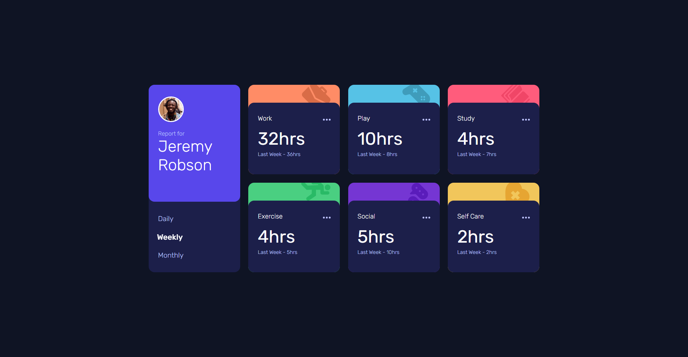
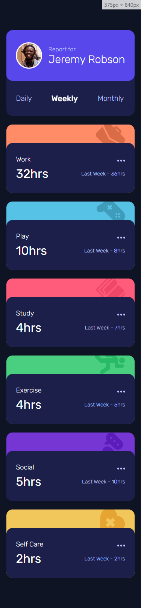

# Frontend Mentor - Time tracking dashboard solution

This is a solution to the [Time tracking dashboard challenge on Frontend Mentor](https://www.frontendmentor.io/challenges/time-tracking-dashboard-UIQ7167Jw). Frontend Mentor challenges help you improve your coding skills by building realistic projects.

## Table of contents

- [Overview](#overview)
  - [The challenge](#the-challenge)
  - [Screenshot](#screenshot)
  - [Links](#links)
- [My process](#my-process)
  - [Built with](#built-with)
  - [What I learned](#what-i-learned)
  - [Continued development](#continued-development)
  - [Useful resources](#useful-resources)
- [Author](#author)
- [SveltKit Readme](#SveltKit-Readme)

## Overview

### The challenge

Users should be able to:

- View the optimal layout for the site depending on their device's screen size
- See hover states for all interactive elements on the page
- Switch between viewing Daily, Weekly, and Monthly stats

### Screenshot




### Links

- Solution URL: [Add solution URL here](https://your-solution-url.com)
- Live Site URL: [Add live site URL here](https://your-live-site-url.com)

## My process

### Built with

- Semantic HTML5 markup
- [SCSS](https://sass-lang.com/guide)
- Flexbox
- CSS Grid
- Mobile-first workflow
- [Svelte](https://svelte.dev) - FrontEnd Compiler
- [Sveltekit](https://kit.svelte.dev/) - Svelte Framework

### What I learned

1. Make posible use SCSS in Sveltekit and make a global style file import whit the svelte.config.js file

   \*\*first -> `npm i -D svelte-preprocess sass`

   \*\*second :

   ```js
   //svelte.config.js
   import adapter from '@sveltejs/adapter-auto';
   import preprocessor from 'svelte-preprocess';

   /** @type {import('@sveltejs/kit').Config} */
   const config = {
   	preprocess: preprocessor({
   		scss: {
   			includePaths: ['src/scss'],
   			prependData: `@import './global';`
   		}
   	}),
   	kit: {
   		// adapter-auto only supports some environments, see https://kit.svelte.dev/docs/adapter-auto for a list.
   		// If your environment is not supported or you settled on a specific environment, switch out the adapter.
   		// See https://kit.svelte.dev/docs/adapters for more information about adapters.
   		adapter: adapter()
   	}
   };

   export default config;
   ```

2. Lear how to use the svelte-motion library

   \*\*first-> import the Motion tag -> `import Motion from 'svelte-motion/src/motion/MotionSSR.svelte'`

   \*\*second-> wrap the componente that u already styled:

   ```js
   <Motion
   	whileHover={buttonHover}
   	whileTap={buttonTap}
   	animate={$timeframe === text ? linkSelected : ''}
   	let:motion
   >
   	<button on:click={changeTimeframe} use:motion>
   		{text}
   	</button>
   </Motion>
   ```

3. And finally of course, learn how to use Svelte and Sveltkit (as a first interaction)

### Continued development

I wanna continue learning Svelte, It's something new to me and some times I get lost but it's amazing when you understand things.

### Useful resources

- [Svelte Motion](https://svelte-motion.gradientdescent.de/animation/) - This helped me for make the animations,Although it didn't seem intuitive to me, I was able to get the hang of it later.

- [Deploy on netlify](https://www.youtube.com/watch?v=1sWBVXUQTII&ab_channel=VidaMRR-Programacionweb) - This is an amazing video which helped me to deploy this challenge on netlifly.

- [How to add SCSS to sveltekit](https://www.youtube.com/watch?v=UzjJ5orVoxk&ab_channel=WebJeda) - A Video that explain how to add SCSS in a easy way

## Author

- Frontend Mentor - [@avalonxii](https://www.frontendmentor.io/profile/avalonxii)
- Instagram - [@avalondev_xii](https://www.instagram.com/avalondev_xii)

---

# SveltKit Readme

# create-svelte

Everything you need to build a Svelte project, powered by [`create-svelte`](https://github.com/sveltejs/kit/tree/master/packages/create-svelte).

## Creating a project

If you're seeing this, you've probably already done this step. Congrats!

```bash
# create a new project in the current directory
npm create svelte@latest

# create a new project in my-app
npm create svelte@latest my-app
```

## Developing

Once you've created a project and installed dependencies with `npm install` (or `pnpm install` or `yarn`), start a development server:

```bash
npm run dev

# or start the server and open the app in a new browser tab
npm run dev -- --open
```

## Building

To create a production version of your app:

```bash
npm run build
```

You can preview the production build with `npm run preview`.

> To deploy your app, you may need to install an [adapter](https://kit.svelte.dev/docs/adapters) for your target environment.
